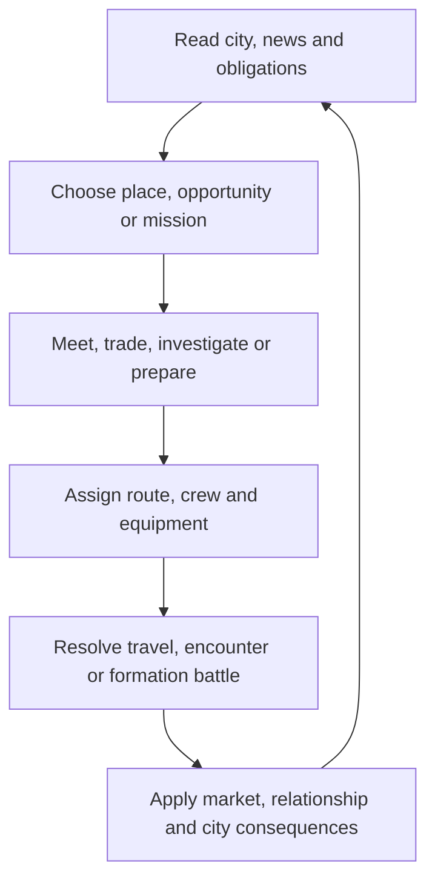

# PIRITORI → EDEN

## Game Design Document — pre-UX baseline

Version: 0.1  
Date: 2026-08-17  
Status: design pass for owner review; not final production scope  
Platform assumption: mobile-first browser prototype, desktop supported  
Audience: adults  

This document defines the game before final UX and art decisions are made. It
supersedes the obsolete parts of `BRIEF.md` that exclude combat, reduce
narrative to small event cards or imply that four screens are already final.
The existing prototype is evidence and a systems test, not the design contract.

The previous Art Bible was rejected and reset. Art direction remains outside
the current PR until a new Finnish, cartoony character baseline is
owner-approved. No current concept image is final production art.

### Decision labels

- **LOCKED** — directly established by the owner and safe to design around.
- **PROPOSED** — the current design recommendation, pending playtest or owner
  approval.
- **OPEN** — a meaningful choice that should not be silently decided.

---

## 1. Executive summary

### High concept

**Piritori → Eden** is a narrative strategy game about two generations running
an illegal stimulant network through Kallio and Pasila. It combines:

- the compressed location arbitrage and debt pressure of the 1984 *Drug Wars*;
- the visible people and traffic flow of *Mini Metro* and *Mini Motorways*;
- authored, choice-heavy street encounters using the readable scene grammar of
  early-1990s point-and-click adventures;
- rare isometric formation battles for variable team sizes, with persistent
  crew injuries and death;
- a family tragedy loosely structured around the brother and inheritance themes
  of *East of Eden*.

The player begins as Aatami at Piritori in 2003, personally buying a small first
quantity and trying to make one route work. He gradually becomes a commander
who sends recruited people to do the dangerous work. In 2024, his son Kalle
inherits the network in Pasila, where amphetamine scarcity, Alpha-PVP, police
pressure and visible social harm have changed the market.

### Product promise

> Build a network inside a living city, meet the people who make it possible,
> and discover that every efficient route carries something back home.

### Genre

**LOCKED:** narrative strategy / market management / squad tactics.  
**PROPOSED:** describe it publicly as a “street-network strategy game,” not a
crime empire simulator.

### Player fantasy and its reversal

The immediate fantasy is reading a city better than everyone else: knowing
where people move, where prices break, who can be trusted and when a route is
about to become dangerous.

The longer arc reverses that fantasy. As Aatami gains control, he becomes more
distant from the people carrying the risk. Efficiency increases while his
family and neighbourhood become harder to read. Power makes the map clearer and
the consequences less abstract.

---

## 2. Design pillars

### 2.1 The ordinary city and hidden market share one body

**LOCKED.** Commuters, shoppers, workers, school traffic, nightlife, product,
cash and enforcement use the same streets and transport capacity. The illegal
layer cannot teleport across an unrelated strategy graph.

The player should be able to see:

- a crowd create both delay and anonymity;
- a closure move people and trade rather than deleting either;
- an overused route become efficient, recognisable and dangerous;
- a mission alter ordinary life at the same location.

### 2.2 Every system is attached to a person or place

Markets are not anonymous spreadsheets. Weapons are not a detached equipment
store. Information is not a generic currency tap. Prices, services and unlocks
come from recurring locations and characters who remember the player.

### 2.3 Choices change play, not just dialogue

Every authored choice must alter at least one of the following:

- access to a route, shop, service or mission;
- a relationship or faction response;
- cash, debt, stock, equipment, time or information;
- crew condition or availability;
- local pressure, ordinary traffic or city harm;
- a later line, encounter or ending state.

There is no separate “good dialogue” layer that leaves the simulation
untouched.

### 2.4 Combat is short, legible and costly

**LOCKED:** battles are short, isometric, alternating-team encounters involving
recruited crew. The rules support variable and asymmetric team sizes; the first
slice concentrates on 2v2 and 3v3. Each side deploys onto a mostly invisible
formation board with **front**, **middle** and **back** rows. Position, cover and
the equipped weapon's valid target pattern matter more than tile-by-tile
movement. Aatami calls the shots and is not a regular combat unit. Weapons,
armour, wounds and casualties matter.

Combat is an escalation inside the strategy game, not the primary reward. A
fight should make the player ask whether the mission was worth the people and
attention it consumed.

### 2.5 Information is incomplete but never arbitrary

The player does not receive perfect prices, faction intentions or mission odds.
Uncertainty comes from missing relationships and changing conditions, not
unexplained random punishment. Better information is earned through places,
people and observation.

### 2.6 The city remembers

Choices persist visually and mechanically. Shops change staff or hours. A
crew member stops appearing. A route stays watched. A memorial remains. A
contact becomes formal, warm, frightened or absent. The map is a record of the
run, not a neutral board reset after every event.

### 2.7 Specific Helsinki, fictional criminal operations

The spatial and social texture should feel local to Kallio and Pasila. Criminal
groups, individuals, exact routes and transactions are fictional or composite.
The game does not model real trafficking techniques, doses, concealment or
police evasion.

---

## 3. Narrative and campaign structure

### 3.1 Era I — Aatami, Kallio, 2003

**LOCKED.**

- Euro is current money.
- Old markka cash still appears but is not legal tender.
- Markka must be physically taken to a staffed bank counter for conversion.
- Television is the main public news authority.
- Feature phones handle calls and SMS only.
- Going online requires access to a desktop computer.
- Aatami starts at Piritori with limited cash, debt, one contact and no
  organisation.
- Jaska, his artist brother, opposes what the business turns Aatami into.
- Aatami eventually moves to Pasila with his sons Kalle and Aaro and calls the
  move Eden.

#### Era I dramatic movement

1. **Street:** Aatami buys and travels personally.
2. **Network:** recruited runners carry stock through routes Aatami selects.
3. **Leverage:** information, equipment and faction obligations open larger
   missions.
4. **Command:** Aatami increasingly acts through a crew roster.
5. **Exit:** Pasila becomes materially reachable while emotional exit becomes
   less credible.

### 3.2 Era II — Kalle, Pasila, 2024–2025

**LOCKED.**

- Kalle inherits and expands the operation.
- Aaro is a sensitive rock musician with his own value and life outside the
  network.
- The 2023 amphetamine seizure is a documented supply shock behind Kalle's
  political accusation; police intent is not established fact.
- Amphetamine is scarce and expensive in parts of the market.
- Alpha-PVP offers aggressive margin while increasing harm and pressure far
  faster.
- Pasila Police Station represents growing institutional pressure.
- Tripla becomes an important ordinary, vulnerable and contested public space.
- Aaro independently leaves for the war in Ukraine in 2025 and dies. This is a
  fixed tragedy, never a mission, reward or punishment for player dialogue.

### 3.3 Canon and variable history

The broad family history remains fixed so the second generation has a coherent
inheritance. The player shapes its cost and texture.

| Fixed history | Variable run history |
|---|---|
| Aatami builds a Kallio network | who joins, survives, leaves or betrays it |
| Aatami moves to Pasila | whether the move feels like refuge, exile or expansion |
| Kalle inherits in 2024 | the strength, debt and relationships he inherits |
| The 2023 seizure occurred | how Kalle interprets and exploits its consequences |
| Aaro rejects the business | the brothers' closeness before his departure |
| Aaro dies in Ukraine in 2025 | what remains unresolved in the family afterward |

### 3.4 Time structure

**PROPOSED:** use discrete time blocks rather than one entire day per click.

- **Day**, **Evening** and **Night** each change available shops, crowds,
  transport, prices and mission risk.
- A normal trip, encounter or mission consumes one block.
- A battle is part of its parent mission and does not charge a second block.
- Prices make one major update per day; local availability can change by block.
- Debt, wages and upkeep settle at the end of Night.
- Arvo's main television bulletin occurs at a predictable boundary, making TV
  feel scheduled rather than a push notification.

**OPEN:** final campaign duration. The original *Drug Wars* 30-day horizon is a
useful pressure reference, but the full narrative campaign should not inherit
30 days until location and battle pacing has been tested.

---

## 4. Core play loops

### 4.1 Campaign loop

### 4.2 The short session loop

A useful mobile session should support one complete meaningful action in three
to six minutes:

1. inspect a changed node or message;
2. choose a response or mission;
3. prepare a route and crew if needed;
4. resolve the scene;
5. see the consequence return to the city.

The player may pause planning indefinitely. Time never advances because the
player is reading a choice or loadout.

### 4.3 The long arc

The long arc repeatedly converts personal access into impersonal capacity:

- meet one seller;
- learn one route;
- recruit one runner;
- unlock one supplier or service;
- delegate repeated work;
- protect or abandon the people maintaining it;
- reach an apparent exit that now depends on the network.

---

## 5. Interaction modes, not final screens

These are five different jobs the game must perform. They do **not** prescribe
final navigation, dimensions or the number of taps between them. That work
belongs to the later UX pass.

### 5.1 Operations map

**Job:** show the city as a moving system and let the player select where to
apply attention.

It must communicate:

- ordinary people flow and congestion;
- known routes and current crew movement;
- active missions and expiring opportunities;
- local market confidence, not necessarily exact prices;
- faction access and local pressure;
- closures, changed opening hours and persistent aftermath.

The map should not contain full dialogue, a complete inventory, a shop catalogue
or a whole battle.

### 5.2 Location encounter

**Job:** turn a node into a place with people, objects, choices and memory.

This mode covers:

- first substance purchase at Piritori;
- seedy shops, bars, restaurants, teller counters and back rooms;
- family scenes at Jaska's studio or Aatami's home;
- investigation, recruitment, negotiation and mission complications;
- narrative choices that unlock or alter systems.

The location is a readable stage with a small action vocabulary. It is not a
static illustrated dialogue card.

### 5.3 Market, crew and loadout

**Job:** compare scarce resources and prepare commitments.

It owns:

- known buy/sell offers and price history;
- cash, debt, stock and capacity;
- recruitable and current crew;
- weapons, armour and support equipment;
- mission requirements and predicted risk;
- wages, treatment and replacement decisions.

It does not replace going to a shop or meeting a contact. The player first earns
access through a location; this surface then supports repeated management.

### 5.4 Isometric formation battle

**Job:** resolve a dangerous contested moment with a small deployed crew against
a readable opposing formation.

It must make clear:

- whose team phase is active;
- each unit's intent, condition, protection and valid targets;
- likely consequences before confirmation;
- retreat, surrender and non-lethal outcomes;
- persistent wounds, losses and attention after resolution.

### 5.5 News and communications

**Job:** explain public change, deliver personal obligations and distinguish
fact from interpretation.

Era I keeps three channels materially separate:

- **TV:** scheduled public news and Arvo Linde;
- **SMS/calls:** terse personal and operational contact;
- **Online terminal:** research, rumours, archives and slower information.

News changes the city. It never exists only as flavour text.

---

## 6. The city simulation

### 6.1 Shared graph

The neutral simulation contains nodes, edges, trips, time, queues and events.
Ordinary and hidden payloads share this graph.

Each edge has:

- movement mode;
- time cost;
- capacity;
- monetary cost;
- visibility and repetition signals;
- temporary state such as delayed, reduced or closed.

Each node has:

- location type and opening schedule;
- ordinary demand;
- crowd and transfer capacity;
- known contacts and services;
- product-owned market, faction and pressure state.

### 6.2 Ordinary movement

People travel for work, school, shopping, food, home, nightlife and visits.
These agents are mechanically relevant:

- they consume capacity;
- create cover or scrutiny depending on context;
- produce predictable daily rhythms;
- respond to closures and events;
- make social harm visible through changed routines.

### 6.3 Hidden movement

The hidden layer includes:

- crew travelling to a mission;
- product moving outward;
- money or information returning;
- equipment transfers;
- attention accumulating around repeated patterns.

The player gives assignments and priorities rather than steering a courier in
real time.

### 6.4 Map accuracy and compression

**LOCKED:** final geography must be based on recognisable Kallio and Pasila
relationships.  
**PROPOSED:** preserve coastline, rail, major streets, relative district
direction and landmark adjacency, then compress minor blocks for play.

The map is not intended to reproduce real criminal routes. Location placement
is a navigational and narrative abstraction built from public geography.

### 6.5 Initial Era I node set

| Node | Primary role | Early access |
|---|---|---|
| Piritori / Kurvi | first purchase, street recruitment, first contested corner | open |
| Sörnäinen station | transport transfer and ordinary crowd flow | open |
| Vaasankatu | Toko Slomo's Noodles and local market intelligence | mission unlock |
| Siltanen / Kuudes Linja | McCormick family services and nightlife | relationship unlock |
| Jaska's studio | family, art and non-commercial choices | open by invitation |
| Harju / Kallio streets | first sale and neighbourhood missions | first purchase |
| Hakaniemi | larger market and southbound connection | route unlock |
| Staffed bank counter | markka conversion and legitimate visibility | opening-hours event |
| Desktop terminal | online research and rumours | location access |
| Restaurant fronts | Jade Lantern Network access and contested services | faction unlock |

The exact count and positions remain open until the map pass.

### 6.6 Pressure is local

There is no single wanted meter that explains the whole city. Pressure belongs
to nodes, routes, crews and factions.

It rises through:

- repeated high-volume movement;
- public incidents and battles;
- failed or exposed missions;
- distinctive equipment or crew patterns;
- faction conflict;
- visible city harm.

It falls or moves through:

- time;
- changed behaviour and reduced volume;
- a route or contact becoming unavailable;
- a narrative intervention;
- attention shifting after a public event.

The game abstracts enforcement response and does not teach real evasion.

---

## 7. Economy and market

### 7.1 Strategic resources

| Resource | Function | Visibility |
|---|---|---|
| Euro cash (€) | purchases, wages, debt, travel, treatment and exit fund | exact |
| Markka (mk), Era I | unusable old cash until teller conversion | exact separate balance |
| Debt | campaign pressure and recurring settlement cost | exact |
| Stock | abstract product units carried or stored | exact units, no dose detail |
| Capacity | how much a crew or route can move | exact |
| Intel | improves offer, mission and faction information | confidence/range |
| Relationships | what a person will offer, conceal or refuse | behavioural, not one morality bar |
| Local pressure | likelihood of disruption at a node or route | readable band plus map state |
| City harm | persistent human and service consequences | mostly expressed through places and events |
| Time | opening hours, deadlines and campaign horizon | exact blocks |

### 7.2 Market model

**LOCKED:** Era I begins with amphetamine; Era II includes amphetamine and
Alpha-PVP. The system remains deliberately non-operational.

A local offer is produced from:

- the location's base supply and demand;
- current supply shocks and public events;
- faction access or interference;
- time of day and opening state;
- recent player saturation;
- quality of information;
- persistent consequences from earlier missions.

The UI should explain the dominant cause of a change: “station closure,” “dry
week,” “festival crowd,” “McCormick pressure” or “old quote.” The player may
still lack the exact final value until arriving.

### 7.3 Information quality

Market information has three levels:

1. **Rumour:** direction only — cheap, rising, scarce or flooded.
2. **Range:** likely buy/sell interval.
3. **Quote:** current exact offer from an accessible contact.

Toko, repeated visits, faction relationships and online research improve
information. A previous quote remains visible with its age.

### 7.4 Unlocking the market

**LOCKED:** the high-level market is not fully open at the beginning.

**PROPOSED progression:**

1. Piritori first purchase exposes one local price.
2. The first neighbourhood sale reveals a second location and price history.
3. A small mission introduces a recruit and route capacity.
4. Toko Slomo unlocks price ranges and information purchases.
5. A faction relationship unlocks recurring larger offers.
6. Territory and intel expose wholesale opportunities and competing supply.

This lets the player learn the market through places before managing it as a
table.

### 7.5 Debt

- The opening debt immediately creates pressure.
- Interest and required payments occur at settlement.
- Debt holders can create missions and relationship consequences, not just a
  numeric penalty.
- Clearing debt removes a threat but does not itself win the campaign.
- Borrowing from a faction may be cheaper in cash and more expensive in future
  obligation.

### 7.6 Markka as dead money

In 2003, markka is not spendable. The official conversion is fixed at 5.94573
markka per euro, so the decision is not currency speculation.

The costs are:

- reaching a staffed counter during opening hours;
- committing a time block and a carrier;
- deciding whether the amount justifies the trip;
- accepting that legitimate spaces can create visibility and narrative risk.

Old notes may appear in forgotten stashes, bar tills, inherited envelopes or
informal payments. The game should never imply ordinary 2003 retailers still
accepted them as current cash.

### 7.7 Alpha-PVP and city harm

Era II creates an intentionally uncomfortable incentive:

- Alpha-PVP can be cheaper, more available and faster to turn over;
- it raises visible harm, distrust and institutional pressure more sharply;
- avoiding it protects some relationships but sacrifices margin and reach;
- using it is never represented as a clean optimal build.

The system expresses a feedback loop. It does not claim that real police
deliberately created the market.

---

## 8. First purchase onboarding

### Purpose

The first purchase at Piritori introduces the game's three kinds of value:
money, information and remembered behaviour.

### Initial situation

Aatami arrives with limited euro cash, debt and no market interface. A seller
has a small offer. The place itself contains information: who watches, what is
closed, where crowds move and whether another buyer is waiting.

### Available approach

The player can first inspect the seller, surroundings and offer, then choose a
response such as:

- buy the small amount;
- ask who controls the corner;
- ask for a different favour or introduction if previously unlocked;
- leave and return later.

Exact copy and prices remain content work, not GDD lock.

### Consequences

| Choice type | Immediate result | Longer memory |
|---|---|---|
| Buy | stock, less cash, first sale route opens | seller sees Aatami as a customer |
| Ask about control | information, possible price or suspicion cost | faction lead opens earlier |
| Negotiate | uncertain price/access outcome | seller remembers confidence or disrespect |
| Walk away | cash preserved, time spent | later offer or attitude changes |

There is no instant campaign failure. This follows the more forgiving lesson
of 1990s adventure design: choices close or reshape opportunities without
creating an invisible unwinnable state.

### Tutorial rule

Do not explain the whole market in text. The scene teaches:

1. look before acting;
2. conversation can be worth more than the displayed transaction;
3. a purchase creates a route opportunity;
4. the city remembers how the interaction ended.

---

## 9. Location encounter system

### 9.1 Design lineage

The useful lessons from early-1990s *Police Quest* and *Leisure Suit Larry* are:

- a location is a readable stage rather than a menu background;
- a small verb set invites inspection and experimentation;
- characters and props carry narrative information;
- strong, economical dialogue gives each place a voice;
- scene state changes after an action;
- icon-led interaction removes parser guessing.

The game should **not** inherit pixel hunting, arbitrary procedure traps,
one-click deaths, dead ends, copied humour, characters or interface art.

### 9.2 Encounter anatomy

A standard location encounter contains:

- one establishing view;
- three to six meaningful hotspots;
- zero to three present characters;
- a small contextual action set;
- two to four consequential dialogue or action choices;
- a clear exit back to the city;
- persistent state for later visits.

### 9.3 Contextual actions

**PROPOSED base verbs:**

- **Look** — observe a person, object or changed detail;
- **Talk** — begin or continue conversation;
- **Use / Give** — apply an inventory item, information or favour;
- **Take / Buy** — acquire an available object or service;
- **Leave** — exit without pretending the encounter is unresolved by accident.

Not every scene exposes every verb. Touch targets and hotspots must be readable;
the game never relies on searching every pixel.

### 9.4 Choice construction

Good choices should oppose kinds of value:

- cash versus information;
- speed versus relationship;
- crew safety versus territory;
- honesty versus leverage;
- family time versus business opportunity;
- immediate control versus future obligation.

Avoid false choices where one answer is obviously correct and the other exists
only to punish curiosity.

### 9.5 Scene memory

Each location tracks a small set of authored changes:

- relationship posture;
- access tier;
- who is present;
- open/closed/damaged state;
- unresolved promise or debt;
- one or two inspected details;
- faction control or pressure.

This should be enough to make repeat visits feel remembered without building a
general-purpose adventure engine before the vertical slice.

---

## 10. Seedy shops and recurring locations

“Seedy” comes from compromised people, worn routines, mixed legitimate and
illicit use, poor lighting, odd opening hours and accumulated history. It should
not be reduced to dirt overlays, addicts as scenery or every proprietor acting
like a villain.

### 10.1 Location service model

Every recurring shop has three layers:

1. **Front:** legitimate business, ordinary customers and safe conversation.
2. **Relationship:** services available because of familiarity or obligation.
3. **Back room:** high-risk offers, faction business or a mission entrance.

Access is social and narrative before it becomes a repeatable menu shortcut.

### 10.2 Initial location roster

| Location | Legitimate surface | Network value | Narrative pressure |
|---|---|---|---|
| Piritori street seller | informal street exchange | first stock, cheap recruits, first weapon gate | who controls the square and who gets used |
| Toko Slomo's Noodles | ramen shop on Vaasankatu | intel, rumours, uncertain sabotage wagers | friendship versus using Toko as an asset |
| McCormick venues | bars and restaurants near Siltanen | hired muscle, weapons, armour, intimidation and sabotage | every purchase creates family obligation |
| Restaurant fronts | ordinary restaurants across Kallio | illicit materials, firearms and faction access | expansion, loyalty and individual motives inside the fictional network |
| Staffed bank | legitimate teller service | markka conversion and cash handling | time, visibility and awkward legitimacy |
| Internet café / terminal | paid computer access | rumours, archives and contact research | information is slow, local and traceable in social terms |
| Jaska's studio | art workspace and gathering place | family trust and alternative contacts | every business interruption has a human cost |

### 10.3 Repeat visits

After a service is earned, repeat transactions may be accelerated, but the
location should periodically demand attention through:

- changed staff;
- a delayed order;
- a favour;
- a competing customer;
- a closed front;
- a relationship confrontation;
- ordinary life interrupting illegal business.

No location becomes a permanently inert catalogue.

---

## 11. Missions

### 11.1 Mission lifecycle

1. **Signal:** rumour, map change, SMS, conversation or news.
2. **Intel:** optional investigation improves clarity or opens alternatives.
3. **Commit:** accept a deadline, cost, promise or faction position.
4. **Prepare:** choose route, deployed team, starting formation, equipment and
   approach.
5. **Travel:** crew moves through the living city.
6. **Encounter:** dialogue, location action, check or complication.
7. **Escalation:** some missions open an isometric formation battle.
8. **Resolution:** reward, loss, relationship and territory effects.
9. **Aftermath:** visible city and roster change.

### 11.2 Mission families

| Family | Core decision | Possible escalation |
|---|---|---|
| Delivery / collection | route, timing, capacity and trust | rival interception or missing contact |
| Information | pay, investigate, trade a secret or accept uncertainty | false lead or faction confrontation |
| Recruitment | price, role, loyalty and existing affiliation | contested recruit or trial mission |
| Negotiation | offer, threat, favour or withdrawal | breakdown into formation combat |
| Protection | which person, shop or route receives limited crew | attack elsewhere or direct battle |
| Recovery | retrieve stock, gear, money or a missing crew member | time pressure and casualty risk |
| Sabotage | invest in an uncertain indirect outcome | exposure, retaliation or unintended closure |
| Family / personal | time and truth rather than profit | lost opportunity, not combat by default |

The game communicates outcomes abstractly and dramatically without teaching
real criminal procedure.

### 11.3 Mission availability

A mission is eligible based on:

- day and era;
- known location;
- relationship and faction state;
- recent market or city event;
- available crew and required role;
- local pressure;
- unresolved promise;
- previous encounter outcome.

The player should usually see two or three competing opportunities, not a map
covered with chores.

### 11.4 Failure

Mission failure moves the campaign forward. It can cause:

- lost time, stock, money or equipment;
- a wounded, missing, arrested or dead crew member;
- a closed service or route;
- higher local pressure;
- faction advantage;
- an altered later encounter.

Avoid reload-dependent perfection and invisible fail states.

---

## 12. Crew and roster

### 12.1 Role of the player character

**LOCKED:** early Aatami may appear personally in low-risk street encounters,
including the first purchase. As the network grows, he becomes the commander.
Recruited crew travel and fight. He is not a standard selectable battle unit.

Kalle follows the inherited commander model in Era II.

### 12.2 Roster size

**PROPOSED vertical-slice roster:** six to eight available crew, with two or
three deployed in the slice and support for larger or asymmetric encounters
later. This allows loss and replacement without turning characters into
anonymous inventory.

### 12.3 Crew record

Each recruit needs:

- name, portrait and origin location;
- field role;
- health and persistent wounds;
- nerve;
- speed / initiative;
- two core competencies;
- one strength and one liability trait;
- weapon, armour and support slots;
- wage or obligation;
- personal relationship and faction history;
- a small number of authored reactions and outcomes.

### 12.4 Field roles

**PROPOSED roles:**

- **Muscle:** protection, control and close pressure;
- **Runner:** speed, delivery and withdrawal;
- **Watcher:** information, marking and target prediction;
- **Fixer:** support, negotiation and improvised solutions;
- **Driver:** route reliability, extraction and capacity;
- **Local:** location-specific access and faction knowledge.

Roles are not rigid classes. Equipment and traits can shift function.

### 12.5 Attachment and replacement

The *Darkest Dungeon* lesson is roster attachment under persistent risk, not
copying stress, formation or gothic cruelty.

Crew become valuable through:

- survival and improved competence;
- location relationships;
- reliable combinations with other members;
- remembered mission outcomes;
- scars and liabilities;
- unique access or dialogue.

Cheap Piritori recruits remain available so one loss does not end the run, but
replacements should not erase the strategic and narrative value of a veteran.

### 12.6 Injury, absence and death

Possible persistent outcomes:

- **Shaken:** reduced nerve until rested or supported;
- **Wounded:** reduced combat availability and treatment cost;
- **Scarred:** permanent trade-off trait after serious injury;
- **Missing / held:** unavailable until a later choice or recovery mission;
- **Dead:** permanent removal and an authored aftermath.

Death is possible but not the default result of reaching zero condition in a
battle. Armour, treatment, the winning side and the exit situation modify the
casualty result.

---

## 13. Isometric formation battles

### 13.1 Combat promise

> Read the other team's intent, decide whose safety to spend, and end the fight
> before the city notices more than it already has.

### 13.2 Scale and encounter sizes

- The combat rules support variable and asymmetric team sizes rather than a
  separate system for each format.
- The vertical slice tests 2v2 and 3v3; later encounters may use one to four
  active units per side when the location and mission justify it.
- Every crew member remains individually important.
- Encounters should finish in two to four minutes.
- A small formation keeps animation and content scope achievable.
- Casualties create meaningful roster gaps.

### 13.3 Battlefield structure

**LOCKED:** combat uses a horizontal isometric view of two mirrored half-boards.
Each side owns three depth rows — **front**, **middle** and **back** — crossed by
three or four lateral lanes. This creates a 3x3 or 3x4 formation board per side.
Only occupied, selected, targeted and reachable cells are normally revealed;
the grid is a rule beneath the scene rather than a permanent checkerboard.

The boards hold fewer combatants than cells. Empty cells create firing lanes,
safe angles and room for deliberate repositioning. A unit occupies one cell and
may move to a valid free cell through a **Reposition** action or an equipment or
role ability. There is no free walking, pathfinding puzzle or movement-point
economy.

Cover is built into the location as a small set of readable objects or cell
edges. It can block a target pattern, reduce pressure from a direction or make a
cell unavailable. Cover is discrete and predictable; it does not require pixel
collision or simulation. Location art changes cover, hazards and objectives but
not the formation grammar.

The intended reference mixture is simplified isometric tactics for spatial
readability, chess-like discrete placement and targeting, and *Darkest Dungeon*
weight in roster consequence and presentation. It is not a free-roaming tactics
map or a side-on four-slot formation.

**LOCKED screen composition:** the battle uses a horizontal layout with the
complete isometric encounter visible above a substantial bottom command
console. A narrow strip at the top owns round state and enemy intent. The bottom
console groups the selected crew member and condition on the left, core actions
in the centre, and automation and withdrawal on the right. Both formations,
cover and target paths remain visible while commands are chosen. The interface
must not turn the battle back into a side-on lineup or cover the spatial state.

### 13.4 Round structure

1. **Read:** opponent intent and likely targets are telegraphed according to
   available intel.
2. **Player phase:** the player's surviving crew act once each in any order.
3. **Opponent phase:** opposing actions resolve.
4. **Fallout:** wounds, nerve, statuses, environmental effects and surrender
   checks resolve.
5. **Decision:** continue, negotiate if available, change command plan or
   withdraw.

This keeps the owner's “your team, then their team” direction while adding
modern intent readability.

### 13.5 Position, cover and weapon reach

Position determines which actions and targets are available:

- **Front:** strongest close pressure and ally screening, but easiest to expose;
- **Middle:** flexible support, short-range attacks and access to most cover;
- **Back:** long-range and support safety, with weaker close response;
- **Lanes:** create direct, diagonal and blocked lines between the two sides;
- **Cover:** protects specific cells or angles instead of granting a universal
  defence bonus.

Weapons use a few readable target patterns rather than measured distance. A
weapon may reach the same lane, adjacent lanes, the opposing front rows or a
long unobstructed line. The interface previews every valid cell and likely
consequence before confirmation. Weapon choice therefore changes formation and
target access, not only damage. The game uses fictionalised weapon categories
and abstract effects; it does not simulate real firearm handling.

### 13.6 Core actions

Every crew member has a small common set plus up to two role/equipment actions.

Common actions:

- **Attack** — apply pressure or injury through equipped weapon category;
- **Brace** — gain protection and resist nerve loss;
- **Cover** — protect an ally and redirect part of an attack;
- **Reposition / Swap** — change to a valid free cell or exchange positions
  through an ability;
- **Use item** — treatment or mission-specific support;
- **Talk / Threaten** — available only when relationship and battle state allow;
- **Withdraw** — begin or support team exit.

### 13.7 Manual and auto-command play

**LOCKED:** manual command remains the primary presentation. An optional
**Auto** mode uses the exact same actions, target rules, telegraphed intent and
consequence model; it is not a separate statistical auto-resolve.

Before an automated round, the player can set a small command plan such as hold
formation, protect a named ally, focus marked targets or withdraw when wounded.
The plan resolves the team's phase visibly. The player can return to manual
control at a round boundary. Auto play saves repetition but cannot reveal hidden
information or avoid the costs of a bad formation.

### 13.8 Combat values

**PROPOSED minimal set:**

- **Condition:** ability to continue the encounter;
- **Guard:** current protection from armour, cover and actions;
- **Nerve:** likelihood of panic, surrender or flight;
- **Tempo:** action ordering inside the team phase and reaction strength;
- **Wounds:** persistent injury risk carried out of combat.

The system should avoid a dense RPG stat sheet.

### 13.9 Status vocabulary

- **Guarded:** protected by cover or ally;
- **Exposed:** easier to hit and injure;
- **Marked:** intent and weakness are more visible;
- **Pinned:** limited movement or action choice;
- **Shaken:** reduced nerve and reliability;
- **Wounded:** increased casualty risk;
- **Fleeing / Surrendering:** leaving combat unless stopped or accepted.

### 13.10 Winning and ending combat

A battle can end through:

- the opposing team withdrawing;
- surrender or negotiation;
- mission objective completion;
- player withdrawal;
- all active members of one side becoming unable to continue.

Killing every opponent should rarely be the optimal requirement. A “win” that
creates deaths, witnesses and pressure may be strategically worse than a
controlled withdrawal.

### 13.11 Consequences

After combat, apply:

- injuries, death or absence;
- equipment loss or damage;
- local and route pressure;
- faction hostility or fear;
- bystander and city-harm effects where relevant;
- shop closure or service disruption;
- crew loyalty and relationship reactions;
- mission success, partial success or failure.

### 13.12 Combat frequency

**PROPOSED:** one battle in roughly four to six missions, with clusters during
open faction conflict. It should remain possible to complete meaningful stretches
through negotiation, information and rerouting.

---

## 14. Factions and power

Territory is not a single colour painted over districts. Multiple groups can
hold different forms of power at the same node: market access, information,
security, social legitimacy or institutional authority.

### 14.1 Aatami / Kalle network

- **Wants:** profitable reach, debt relief, survival and an eventual exit.
- **Offers:** money, routes, employment, protection and leverage.
- **Weakness:** depends on people and places it increasingly treats as replaceable.

### 14.2 Piritori independents

- **Wants:** immediate cash, survival and freedom from larger obligations.
- **Offers:** small stock, cheap recruits, street information and the first
  weapon gate.
- **Weakness:** low reliability and constant exposure to stronger groups.

### 14.3 Toko Slomo

- **Wants:** to keep his shop, relationships and personal safety intact.
- **Offers:** insider fragments, introductions and uncertain sabotage wagers.
- **Weakness:** Aatami's use of him can destroy the trust that makes him useful.

Toko is a contact, not a faction army.

### 14.4 The McCormick family

- **Wants:** obligation, territory around its venues and a reputation for force.
- **Offers:** hired muscle, weapons, armour, intimidation and sabotage.
- **Weakness:** family politics and visible methods create grudges and attention.

They should feel like a large compromised family, not a generic gun shop.

### 14.5 Jade Lantern Network — working fictional name

- **Wants:** expansion through restaurant fronts and control of illicit material
  supply.
- **Offers:** firearms, materials, logistics and access across several locations.
- **Weakness:** distributed fronts have individual motives and competing
  loyalties.

The organisation is entirely fictional. Members must be written as distinct
people; ethnicity is never a gameplay trait or shorthand for menace. Final
name and representation remain subject to the narrative and Art Bible review.

### 14.6 Police and public institutions

- **Wants:** vary by unit, person, public mandate and political context.
- **Exerts:** surveillance, closures, seizures, arrest risk and resource pressure.
- **Narrative role:** a powerful institution whose actions can reshape the
  market, not a faceless species of combat target.

Routine tactical battles should primarily involve rivals and hired crews.
Police confrontation is normally handled through the city, mission and
consequence systems. Any direct armed encounter requires explicit later review.

---

## 15. Narrative system

### 15.1 Delivery layers

- authored location encounters;
- crew banter and reactions;
- calls and SMS;
- Arvo Linde television reports;
- map changes and absent people;
- market descriptions tied to a cause;
- end-of-day family or obligation choices;
- generation-to-generation inheritance.

### 15.2 Arvo Linde

Arvo is a fictional homage to the calm authority and formal delivery associated
with Finnish broadcaster Arvi Lind. He is not a literal portrait or fictional
mouthpiece for the real journalist.

His function is to separate:

- **DOCUMENTED:** supported public event;
- **INFERENCE:** plausible systemic connection;
- **ACCUSATION:** a character's contested claim;
- **FICTION:** invented people, routes and outcomes.

Arvo may sound certain while the labels make epistemic limits visible.

### 15.3 Choice depth

“Narrative-heavy” means repeated interaction and consequence, not maximum word
count. A major encounter may include several short exchanges, inspected objects
and a decision. A routine event should remain concise.

Each meaningful choice records:

- immediate effect;
- one remembered relationship flag;
- possible delayed trigger;
- visible world consequence where applicable;
- source status if it references real events.

### 15.4 Tone

- local, dry and observant;
- intimate before epic;
- funny because people are specific, not because suffering is spectacle;
- haunted rather than relentlessly grim;
- no Scarface fantasy or generic gang caricature;
- no “zombie” language except as a dehumanising term the story challenges.

### 15.5 Family choices

Family scenes should not become a morality vending machine where time with Jaska
or Aaro awards obvious “good points.” They alter trust, information, availability,
memory and endings, while sometimes costing a uniquely profitable opportunity.

### 15.6 Historical article use

Public reporting can inspire:

- supply shocks;
- closures and displacement;
- changing transport or nightlife;
- public debate and institutional powers;
- service pressure;
- mission timing and rumours.

It never imports a vulnerable private person as a character or turns an
unproven allegation into game fact. Sources and fictional transformations are
logged in `NEWS_SOURCE_LEDGER.md`.

---

## 16. Progression

### 16.1 Era I capability sequence

**LOCKED order, tuning open:**

1. arrive at Piritori;
2. complete or reshape the first purchase encounter;
3. make the first nearby sale;
4. meet or hire the first runner;
5. see an ordinary route carry a hidden payload;
6. reach Toko Slomo and buy information;
7. manage several known offers through the market surface;
8. recruit a three-person mission team;
9. obtain the first firearm at Piritori, unlocking battle-capable missions;
10. survive or avoid the first formation-combat escalation;
11. reach the McCormicks and restaurant fronts;
12. delegate recurring work and become a commander;
13. build the resources and relationships that make Pasila possible;
14. leave Kallio while carrying forward the run's consequences.

### 16.2 Types of advancement

- **Knowledge:** more accurate quotes, intentions and mission odds;
- **Access:** new places, back rooms, contacts and services;
- **Capacity:** crew, routes, storage and transport;
- **Force:** weapons, armour and battle options;
- **Leverage:** favours, obligations and faction influence;
- **Exit:** money and relationships supporting the move to Pasila.

Power should broaden decisions rather than only increase numbers.

### 16.3 No conventional level grind

Crew may improve, but progression primarily comes from network knowledge,
surviving relationships and equipment. Repeating a risk-free action for generic
experience should not be the optimal play pattern.

---

## 17. Failure, success and endings

### 17.1 Mission failure

Individual failure is expected and recoverable. It changes the run instead of
requiring reload.

### 17.2 Campaign failure conditions

**PROPOSED:**

- debt obligation cannot be met and no lender or sacrifice remains;
- no crew can perform the required work and no recruitment access remains;
- pressure and faction state close every viable starting route;
- a fixed campaign deadline arrives without any survivable outcome.

Arrest, disappearance or forced exit may be authored endings rather than a
generic game-over overlay.

### 17.3 Era I success matrix

The move to Pasila is broadly fixed, while its meaning is calculated from:

- debt cleared or transferred;
- exit fund;
- surviving crew and unresolved obligations;
- Jaska relationship;
- faction entanglement;
- city harm and local pressure;
- whether Aatami still performs the work or has become fully detached.

The richest outcome is not automatically the best.

### 17.4 Era II ending matrix

Kalle's ending considers:

- inherited and created debt;
- amphetamine versus Alpha-PVP dependence;
- harm and enforcement pressure;
- relationship with Aaro before his departure;
- Aatami's remaining influence;
- network scale and survivability;
- whether any inheritance is interrupted.

Aaro's death is never scored as a consequence of choosing the “wrong” branch.

---

## 18. Information, readability and fairness

### 18.1 Forecast before commitment

Before an irreversible action, show what Aatami reasonably knows:

- time and cash cost;
- required crew or equipment;
- known pressure band;
- likely opposition size;
- possible relationship stake;
- information confidence;
- whether battle is possible, likely or already unavoidable.

Unknowns remain clearly marked rather than silently rolled.

### 18.2 Consequence recap

After a mission or choice, show only the changes needed to understand the new
state, then express them in the world. A list of twelve floating currencies is
not a substitute for a closed shop or missing crew portrait.

### 18.3 No hidden dead ends

Inspired by the more forgiving side of later Sierra design:

- leaving a scene is valid;
- missing optional information changes risk but does not secretly invalidate
  the campaign;
- required items and people are recoverable or replaceable;
- failure branches forward;
- the game does not expect exact procedural trivia from the player.

---

## 19. Functional audio direction

The future Art Bible will establish the material-motion relationship; a later
audio pass will define sound character. The GDD requires functional cues for:

- route load and transfer;
- opportunity expiry;
- shop opening and closing;
- incomplete versus confirmed information;
- battle intent, guard break, nerve loss and withdrawal;
- cash and stock exchange;
- television bulletin start;
- SMS arrival;
- a person or service becoming unavailable.

Audio should clarify state without celebrating violence or turning the city into
constant sirens.

---

## 20. Accessibility and content responsibility

### Accessibility baseline

- touch targets suitable for one-handed mobile use;
- keyboard and controller path for desktop;
- text scaling and high-contrast option;
- colour never carries state alone;
- reduced motion and pause at any planning or reading point;
- subtitles and speaker identification;
- battle intent represented by icon, text and motion;
- no time loss while reading or navigating accessibility settings.

### Content baseline

- adult-content warning before play;
- no dosing, preparation, concealment or real route instruction;
- no real private person used as a criminal character;
- vulnerable people retain individuality and ordinary needs;
- violence has persistent human and strategic consequence;
- ethnicity is not a faction mechanic;
- historical claims remain sourced and labelled.

---

## 21. Shared engine relationship with Toko Move

Toko Move remains a separate family-friendly product using the same neutral city
flow foundation.

### Shared

- map graph and coordinate transform;
- time and schedules;
- ordinary trips, queues and capacity;
- route creation and pathfinding;
- closures and event hooks;
- deterministic seed and save/replay;
- input, camera, accessibility and flow rendering contracts;
- functional audio events.

### Piritori-only

- criminal market, stock, debt and local pressure interpretation;
- contacts, factions and adult narrative;
- location-adventure encounter data;
- crew, equipment, wounds and death;
- mission and isometric formation-battle systems;
- historical-news framing and city harm;
- two-generation campaign.

### Toko Move-only

- public transport and private mobility planning goals;
- access, pollution, freight and service scoring;
- family-friendly events and presentation;
- no drug, weapon, faction or criminal assumptions.

The shared engine should not force Toko Move to carry unused battle or adult
story code.

---

## 22. Content authoring model

### 22.1 Location record

- id, era, map node and opening schedule;
- establishing scene and hotspot list;
- characters by state;
- service tiers;
- faction and pressure modifiers;
- persistent flags;
- possible encounter ids.

### 22.2 Encounter record

- trigger and eligibility;
- participants and location state;
- inspectable details;
- short exchange nodes;
- choices and requirements;
- immediate effects;
- delayed triggers;
- memory flags;
- source-status label where needed;
- exit state.

### 22.3 Mission record

- signal source and deadline;
- destination and route requirements;
- crew role and equipment requirements;
- intel levels;
- approach choices;
- encounter and possible battle ids;
- success, partial and failure outcomes;
- aftermath effects.

### 22.4 Battle record

- location variant;
- opposing team and intent logic;
- cover / slot modifiers;
- mission objective;
- negotiation and withdrawal conditions;
- casualty and aftermath tables.

### 22.5 News record

- date and channel;
- documented fact, inference, accusation and fiction fields;
- source link and internal note;
- map, market and mission effects;
- Arvo copy and optional character responses.

All authored content should be data-driven enough for narrative iteration without
editing simulation code.

---

## 23. Vertical slice recommendation

### 23.1 Purpose

Prove that the map, authored encounters, market and battle feel like one game.
Do not attempt the entire two-generation campaign before this works.

### 23.2 Slice scope — Era I

**PROPOSED:**

- seven in-game days with two active blocks per day for the first test;
- one geographically credible compressed Kallio map;
- seven or eight active nodes;
- visible ordinary people flow using walking and one public mode;
- Piritori first purchase encounter;
- four other recurring location scenes:
  - Toko Slomo's Noodles;
  - Jaska's studio;
  - one McCormick venue;
  - staffed bank counter;
- one restaurant-front teaser without full faction campaign;
- one product and five known market offers;
- debt and markka conversion;
- six recruitable crew with three field roles represented;
- four mission families;
- two authored formation battles — one 2v2 and one 3v3 — with one avoidable
  through information;
- persistent wounds and one possible death outcome;
- one Arvo bulletin with a sourced public event;
- ten to fourteen meaningful narrative encounters;
- one ending state showing whether Pasila became more reachable.

### 23.3 Toko Move proof in the same milestone

Keep a minimal shared-engine test runnable:

- same neutral graph, time and ordinary trips;
- family-friendly service goals;
- no imported Piritori data or terms;
- one closure and one congestion response.

It does not need parity with Piritori's authored content during this GDD slice.

### 23.4 Explicitly outside this slice

- full Pasila / Era II campaign;
- full 30-day balance;
- base building;
- multiplayer, PvP or live services;
- procedural narrative generation;
- real-world route import;
- more than one complete faction war;
- police gunfights;
- final art, final animation or final audio;
- monetisation.

---

## 24. Prototype gates

The slice should not advance to production content until playtests can answer:

1. Does watching ordinary movement produce useful criminal-network decisions?
2. Does the first purchase teach that information can be worth more than the
   transaction?
3. Do shops feel like recurring places and relationships rather than menus?
4. Does every major narrative choice visibly change play?
5. Can players explain why a market offer changed?
6. Is route repetition readable before it becomes dangerous?
7. Are formation, cover and weapon reach understandable without leaving the
   battle view or exposing the full grid?
8. Are battles rare and consequential enough to support roster attachment?
9. Does losing a veteran hurt without making the run unrecoverable?
10. Do the map, location scenes and battles feel like one game rather than
    separate prototypes?
11. Is the portrayal bleak without reducing vulnerable people to atmosphere?
12. Does the player understand the difference between documented news and
    Kalle's accusation?

### Kill or redesign conditions

- If the market is consistently more interesting as a table than on the map,
  reduce or redesign the flow simulation rather than keeping it decoratively.
- If location encounters are only clicked through for rewards, strengthen
  observation, memory and alternate outcomes.
- If combat becomes the default profitable solution, lower its rewards and
  increase persistent consequences.
- If crew death feels random, improve telegraphing and casualty mitigation.
- If the five interaction modes feel fragmented, reduce their number or create
  stronger state continuity before adding content.

---

## 25. UX requirements to carry into the later UX pass

The GDD does not lock layouts, but the eventual UX must support:

- horizontal gameplay composition with mobile, tablet and desktop adaptation;
- one-handed map inspection without requiring one-handed battle play;
- fast return to the exact city context that opened a location or mission;
- persistent visibility of time, cash and urgent obligations;
- local rather than global pressure reading;
- dialogue choices with visible costs when Aatami could reasonably know them;
- comparison of the currently deployable crew without tiny text;
- clear transition from map travel to authored encounter to battle and back;
- no modern smartphone metaphor for Era I;
- TV, feature phone and desktop internet as distinct narrative channels;
- save/resume at every non-combat decision boundary;
- no hover dependency;
- no final visual style assumed from current concepts.

---

## 26. Open decisions

### Required before full UX design

1. Final campaign time model and length.
2. Whether location scenes use persistent verbs, fully contextual actions or a
   hybrid.
3. How often Aatami appears physically after becoming a commander.
4. Exact battle lethality and casualty frequency.
5. Maximum deployed team size after the vertical slice.
6. Whether the wider 3x4 board is a mission modifier or the default board.
7. Which location owns recurring market access after the introductory missions.
8. Exact meaning of Eden: home, exit fund, Pasila, relationship or deliberately
   unstable promise.
9. Whether refusing the first purchase creates a short alternate opening or
   simply delays acceptance.
10. How much of Era I can be inherited mechanically by Kalle rather than only
   reflected in authored scenes.

### Required before content production

1. Final fictional faction and venue names.
2. Character roster, ages and visual descriptions.
3. Exact Kallio and Pasila map boundaries.
4. Final product naming and abstraction level.
5. Historical events selected for missions and broadcasts.
6. Aaro's full arc and family-scene count.
7. Rating, content warnings and localisation plan.

---

## 27. Reference lessons

These references define useful design lessons, not assets or interfaces to
copy.

| Reference | Adopt | Reject |
|---|---|---|
| [Drug Wars (1984)](https://en.wikipedia.org/wiki/Drug_Wars_%28video_game%29) | compressed local arbitrage, debt, capacity, one-way time pressure and readable shocks | menu-only world, police caricature, rewards for killing police and operational detail |
| [Mini Metro](https://dinopoloclub.com/) | visible automatic agents, redrawable routes, limited capacity and understandable overload | station-shape language and emotionally neutral abstraction |
| [Mini Motorways](https://dinopoloclub.com/mini-motorways-2025/) | a city growing around earlier choices, rerouting and bottleneck readability | coloured destination matching, road-tile economy and exact icon grammar |
| [Police Quest collection manual](https://sierrahelp.com/Documents/Manuals/Police_Quest_Collection_-_Manual.pdf) | readable location staging and a small icon vocabulary for looking, talking and using | procedural trivia traps, arbitrary failure and copied police fantasy |
| [Leisure Suit Larry 5 manual](https://archive.org/details/lsl5-playspy) | colourful authored locations, icon-led interaction, concise character voice and a more forgiving adventure structure | sexual-gag mechanics, copied humour, characters or interface art |
| [Darkest Dungeon](https://store.steampowered.com/app/262060/Darkest_Dungeon/) | flawed recruitable roster, persistent injury, death and strategic attachment | exact stress, class, formation, dungeon or gothic systems |
| *Tactics Ogre* | isometric spatial readability, formation planning and terrain consequence | free-roaming maps, elevation simulation and large ability catalogues |
| [Final Fantasy X combat discussion](https://square-enix-games.com/en_GB/news/whats-good-about-final-fantasy-x) | time to read a turn, adjust strategy and understand party roles | large ability catalogues, fantasy spectacle and heroic power escalation |
| *East of Eden* | brothers, inheritance, choice, repetition and the uncertain promise of Eden | direct plot, dialogue, scenes or character adaptation |

---

## 28. Authority and companion document

This GDD is the current pre-UX design authority once owner-reviewed. Specifically:

- location encounters are a core interaction mode;
- variable-size isometric formation combat is part of the intended game, with
  2v2 and 3v3 encounters in the vertical slice;
- the first purchase is an authored Piritori encounter;
- seedy shops are recurring narrative locations, not detached catalogues;
- the market unlocks through street missions and relationships;
- the five interaction modes are functional requirements, not final screens;
- existing art concepts are exploratory.

The previous Art Bible and its screen tests were rejected. A replacement will
define medium, character construction, environments, map language, combat
staging and production rules only after a Finnish, cartoony character direction
is owner-approved. Final UX and asset counts remain gated by that decision.
