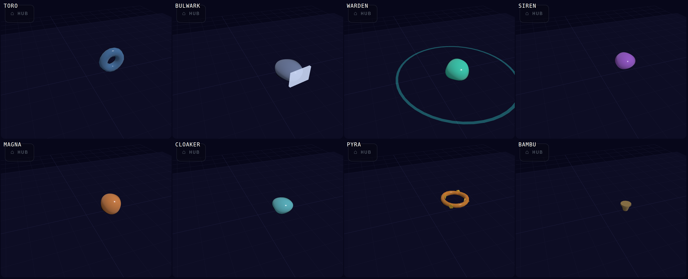

# PLAYTEST — 2026-09-17: balance, polish, and the enemies' looks

*Owner: "Test the game and come up with balance and polish. Then pick up on
the previous" — the previous being "take a look at our other enemies, the way
Toro looks. Maybe pitch some changes, variations, or even new ones." Pitches,
not decisions. Every number here was measured, and the method is in §1 so it
can be re-run.*

---

## 1. Method — a bot on a frozen clock

No human can play here, so a scripted player was driven through the **real
game loop** on a frozen clock (the `level-smoke.sh` trick: `performance.now`
replaced by a counter, `loop()` called synchronously, render and HUD stubbed).
**Ten runs: five CLOSE COMBAT (the default), five classic**, up to 160 s each
or until death. The bot kites away from the nearest threat inside 4.5 u,
otherwise circle-strafes the nearest body, aims and auto-fires at it, and
dashes out of anything inside 1.4 u. `tryHitPlayer` and `onKill` were wrapped
to attribute every hit and kill to a species; every wave logged its duration,
spawns, peak bodies, peak enemy bullets and HP lost.

**What the bot is and is not.** It is a consistent, mediocre player with no
pattern memory — it never learns a species. That makes it a fair instrument
for *pacing* and *pressure* (how much is on the floor, how fast it arrives,
what actually lands hits) and a bad one for *fun*. Nothing in §3 is a
recommendation about feel; §3 is where the pressure is, in numbers.

---

## 2. What the runs measured

### 2.1 Survival

| mode | runs | died at wave | seconds alive |
|---|---|---|---|
| CLOSE COMBAT (default) | 5 | 8, 4, 6, 4, 6 | **42 s avg** |
| classic | 5 | 10, 15, 11, 9, 6 | **67 s avg** |

**The default mode kills the same player in two-thirds the time.**

### 2.2 Wave pacing — the 20 s round is a fiction

| wave | CLOSE COMBAT dur | classic dur | classic peak bodies | classic peak enemy bullets | CC peak enemy bullets |
|---|---|---|---|---|---|
| 1 | 5.0 s | **3.5 s** | 2.0 | 0.0 | 18 |
| 2 | 7.6 | 6.5 | 5.2 | 0.8 | **37** |
| 3 | 7.6 | 6.2 | 7.8 | 8.6 | 35 |
| 4 | 8.4 | 9.7 | 9.2 | 18.2 | 38 |
| 5 | 6.9 | 6.1 | 5.2 | 8.8 | 30 |
| 6 | 7.4 | 7.1 | 11.2 | 8.0 | 47 |
| 8 | 7.4 | 7.9 | 3.5 | 34.2 | **85** |
| 10 | — | 4.8 | 13.3 | 9.7 | — |

- **A round lasts 5–8 s, not 20.** `ROUND_DUR` is 20 but a wave ends on an
  empty floor, and the floor is empty in single digits of seconds. The clock
  never binds. **Wave 1 in classic is 3.5 s and two bodies — a non-event.**
  Classic wave 10 arrives at **61 s**; wave 15 at 90 s.
- This matters for the pulses decision (`PROGRESSION_DESIGN.md` §7, Q2/Q4):
  a 20 s pulsed round would make every wave **~3× longer in wall time**, so
  the same wave number arrives 3× later and the game is 3× easier per minute
  unless escalation is re-based on *time*, not wave count.

### 2.3 Revenge — the number behind "quite a lot"

In CLOSE COMBAT the living are muzzled, so **every enemy bullet on the floor
is a corpse's.** Peak enemy bullets in flight at **wave 2: 37** (classic: 0.8).
At wave 8: 85. Bot HP lost per wave in CC from wave 2: 0.4–0.6 of 3; in
classic, **zero through wave 3**. The default mode's early game is a bullet
game the classic mode does not have.

### 2.4 Who actually lands hits

| | hits |
|---|---|
| **CLOSE COMBAT** (15 hits / 5 runs) | ORANGE_CUBE 4 · GLOBBO 3 · SPITTOR 2 · SLUDGE_CUBE 2 · YELA_CUBE 2 · SLUG 1 · PURP_MINI 1 · FANNER 1 |
| **classic** (15 hits / 5 runs) | **SLUDGE_CUBE 6** · PURP_MINI 3 · GLOBBO 2 · RIBBON 1 · ORANGE_CUBE 1 · FANNER 1 · YELA_CUBE 1 |

- **SLUDGE_CUBE is the top killer in classic** — 6 of 15 — because its trail
  catches a kiting player. It is also the **second most spawned** body in
  classic (84 in 5 runs, behind GLOBBO's 122). A special-damage species that
  common stops being special.
- **The RIBBON dealt 1 hit in 10 runs.** 10 spawned, 10 killed, hp 4, speed
  2.6 — decoration. It was drawn **0 times in five CLOSE COMBAT runs** (it is
  in `poolMelee`; ~30 waves should have drawn it ~4 times — worth checking).
- **The SLUG multiplied**: 36 slug bodies in 5 CC runs from far fewer
  spawns; one run logged **22 splits**; **43 bodies alive at wave 8.** In
  CLOSE COMBAT the kill method is the *dash-cut*, which by nature goes
  through the middle — so in the default mode the slug cannot be killed
  cleanly, only multiplied. And a 3-segment slug hit in the middle becomes
  two **one-segment "slugs"** — a dome with an eye, which is not the design.

### 2.5 Cost per body, hardware-independent

Swiftshader's ms/frame is a software rasteriser stalling and is *not* a
phone number (it timed "8 GLOBBO" cheaper than an empty floor). These are:

| cast | update ms/frame | draw calls | triangles |
|---|---|---|---|
| empty floor | 0 | 20 | 109 k |
| 8 GLOBBO | 0.04 | 28 (**1 each**) | 164 k |
| 8 TORO | 0.04 | 68 (**6 each** — torus + 5 spike meshes) | 112 k |
| 8 SLUG (88 segments) | 0.14 | 124 (**13 each** — 11 segments + eye + head shadow) | 128 k |
| 8 RIBBON | 0.26 | 36 (2 each) | 112 k |

Update CPU is negligible everywhere. The slug's real cost is draw calls;
v252 already removed the tail's shadow casters and a needless `DoubleSide`
(it was 23 per body). TORO's six is a surprise worth fixing (§4 P2).

---

## 3. Balance pitches — in the order the numbers argue for

**B1. Revenge volume in the default mode.** 37 bullets at wave 2 from
corpses alone; the bot dies 40% sooner than in classic. Three levers, from
smallest to the one the family Q&A already leans to:
a) **Counts down** — RING 4/7 → 3/5, AIMED 3 → 2, FAN 5 → 4.
b) **A revenge cap on the field** — e.g. 24 live revenge bullets; a corpse
   that would exceed it blooms nothing. (The 240 is the bullet *pool*, not a
   design number.)
c) **Named species only, from wave 3–4** — `PROGRESSION_DESIGN.md` §7 Q3's
   lean. Wave 1–2 with zero corpse fire; the first biter is the most
   readable (RING), one speed, seeded.
*Lean: c + b. a alone keeps the wall, just thinner.*

**B2. Re-base escalation on time before pulses ship.** Today: wave 10 at
61 s. If a round becomes a real 20 s, wave 10 is at 200 s and the first
minute is wave 3. Either the budget/speed ramps read the run clock, or the
pulsed round is shorter than 20 s (10–12 s keeps wave 10 near 2 min). Decide
this with Q2/Q4, not after.

**B3. Slug splitting needs a floor and a ceiling.** Floor: a chain must be
**≥ 4 segments to split**; shorter, a middle hit shortens. Ceiling: **a split
child never splits again** (or a slug splits at most twice), so one spawn is
at most three animals, not twenty-two. And the CLOSE COMBAT problem: **a
dash through a slug should EAT every segment it crosses** — it is a cut,
not a shot — so the default mode has a clean kill too.

**B4. The RIBBON needs a job.** It is a whip that never cracks. Speed 2.6 →
**3.6**, `turnRate` 2.2 → **3.2** (it cuts across the player's arc instead of
trailing it), hp 4 → 3. And check the CLOSE COMBAT draw — 0 in ~30 waves.

**B5. SLUDGE_CUBE cost 2 → 3.** Top killer, second most common; the green
"leaves something behind" species should be an event, not the floor.

**B6. Wave 1 is a non-event.** 3.5 s, two bodies. A floor of **4 bodies** or
a **6 s minimum round** — whichever survives B2.

**B7. Not pitched, noted:** PURP_MINI (108 in 5 classic runs, 3 hits) is the
swarm and is fine; enemy bullets peak at 79–85 by wave 8–11, which is the
shooter game working; score reaches 1.87 M at wave 15 on the streak
multiplier — a scoring pass is a different day.

---

## 4. Polish pitches

**P1. SLUG as one draw call.** An `InstancedMesh` of a unit sphere with
per-instance scale: 13 calls → 2. Also removes the per-hit mesh rebuild.

**P2. TORO as one draw call.** Merge the five spike cones into the torus
geometry (`BufferGeometryUtils.mergeGeometries`): 6 → 1. Eight TOROs on a
boss wave are 48 wasted calls today.

**P3. Three one-liners already on the ledger** (`PROGRESSION_DESIGN.md` §6):
VOLATILE's ring at 1.0× while every other revenge bullet is 0.6×; revenge
RING phase on `Math.random()` so dailies diverge at the first bloom; PYRA
`HUNTER` at speed 0.

**P4. The size–speed rule** (§7 Q17: *big = slower*) is broken by name:
WEEVA (spd 0.6) is r 0.8 while SPITTOR (spd 1.6) is r 0.9. WEEVA → 1.0,
SPITTOR → 0.75. SPLITTA (r 1.1, spd 1.0) already obeys it.

**P5. Two dome hues 1° apart:** WARDEN 170° vs GLOBBO 169°. The shield-bearer
should not share a colour with the fodder — **WARDEN → gold** (it is a
shield). And **SIREN has no rest tell** — a lilac dome with nothing on it
until it screams; a slow emissive throb at rest would say "this one makes
noise".

**P6. Chain heads that inherit nothing.** When a slug's head dies the next
segment leads, but it keeps its small radius. The new head should grow to
head size over ~0.4 s — the animal "re-heads".

---

## 5. The enemies' looks — TORO first

*`design/closeups-2026-09-17.png` — lab default camera. The roster sheet
from 09-16 is in `design/roster-sheet-2026-09-16.png`.*

### 5.1 TORO — the top threat that looks like a mid body

By the numbers TORO is the hardest non-boss on the floor: **speed 5, hp 6**
(next: BULWARK hp 4, spd 1.5). On screen it is a **small blue donut**. What
the picture says, with the code behind it (`enemy.js:768–800`,
`TUNING.toro`):

- **The rim spikes do not exist at game scale.** Five cones, 0.12 wide ×
  0.30 long, on a rim of radius 0.68. In the close-up they are bumps; from
  the game camera they are gone. The "sawblade" idea is in the code and not
  on the screen.
- **The rev-up spin is invisible.** `_wheel.rotation.z` accelerates through
  the 1.6 s rev — the tell before the dash — but a featureless torus
  rotating about its axle *does not change its picture*. The spin tell
  exists only for the code. All of TORO's telegraph is the red arrow.
- **Its colour is its neighbour's.** Blue 210°, next to BULWARK's steel 222°
  — a charger and a plate-walker, both blue, both "heavy", different
  families so the rule allows it, but nothing in the hue says *fast*.
- Radius 1.0 is the same as PYRA's and near SPLITTA's 1.1. Durability is not
  in the silhouette.

**Pitches, cheapest first:**

- **T1. Make the spin readable.** A hub disc with **3–4 spokes** (or a cut-out
  wedge in the tyre) so the rev is a picture: slow spin at idle, blurring
  through the rev. This is the single change that gives TORO a *body* tell to
  match its arrow. One extra mesh — or none, merged (P2).
- **T2. A sawblade, actually.** Spikes 5 → **8**, length 0.30 → **0.70**, base
  0.12 → **0.20**. At game scale that is a toothed wheel, and a toothed wheel
  reads as "do not touch" without a manual.
- **T3. Tyre and tread.** Tube radius 0.32 → **0.42** and a **dark value band**
  around the tread (same hue, lower value — colour = species holds). Wider,
  heavier, more wheel.
- **T4. Bank into the creep.** During idle it yaws to face its travel; a
  small **roll toward the turn** (the way a bike leans) makes the creep read
  as a wheel rolling, not a donut sliding.
- **T5. Size 1.0 → 1.2.** The one body whose hp/speed both say "biggest
  threat" should be the biggest non-boss on the floor.

**Variations of TORO** — same family (the torus), each a distinct species by
colour and one changed rule:

- **TWIN TORO** — two wheels on an axle, 3 u apart, that dash *as a wall*.
  You cannot sidestep it, you must get outside it. Colour: a second hue.
- **REBOUND TORO** — the dash does not stop at the wall; it **bounces once**,
  and the telegraph arrow shows the reflected leg too. Twice the dash, one
  rev. Colour: red-orange (it is angrier).
- **RIM TORO** — never revs, never stops: rolls at 60% dash speed with an
  arc-mover's turn rate (§8.9's `TUNING.arc`), always coming round. The
  arc-mover family's wheel.

### 5.2 The others, briefly

- **BULWARK** — the plate is the identity and reads perfectly; the *body*
  behind it is a grey dome, i.e. fodder-family with a shield. Under *family =
  shape*, a **plated cube** says "heavy" the way a plated dome does not.
- **WARDEN** — the aura ring is the tell; the body is 1° from GLOBBO (P5).
- **SIREN** — nothing at rest (P5). A body that *screams* could have a
  visible "bell": a slightly open top on the dome, the one silhouette
  modifier the dome family would carry.
- **MAGNA** — amber 27°, next to ORANGE_CUBE 32° and PYRA 36°; different
  families, so allowed, but three warm-orange bodies in a wave is a smear.
  Its tether is the tell and it is good.
- **CLOAKER, PYRA, BAMBU** — fine. PYRA's ring and BAMBU's stack are the
  clearest one-offs in the roster; BAMBU is *tiny* until it grows, which is
  the point.

### 5.3 New ones — "more may arise"

- **SLUG boss** — 25 segments, only the ends take damage, a middle hit
  bounces off. The whole arena is its body for a while.
- **SPORE** — a dome that leaves a **puddle when it dies** (green = leaves
  something, §8.2). The corpse-effect for chasers that is not a bullet —
  answers Q8's "mixed field" with an effect instead of more fire.
- **WIRE** — a ribbon that **anchors its tail** and sweeps like a whip around
  a post. Solves the ribbon's "no silhouette when it stops" by making the
  stop the shape.

---

*Ship order, if any of it ships: P3 (three one-liners) → B3 (slug floor and
ceiling, dash eats) → B1c+b (revenge) → T1+T2 (TORO reads) → P2/P1 (draw
calls) → B4/B5/B6. B2 is a decision, not a change.*
