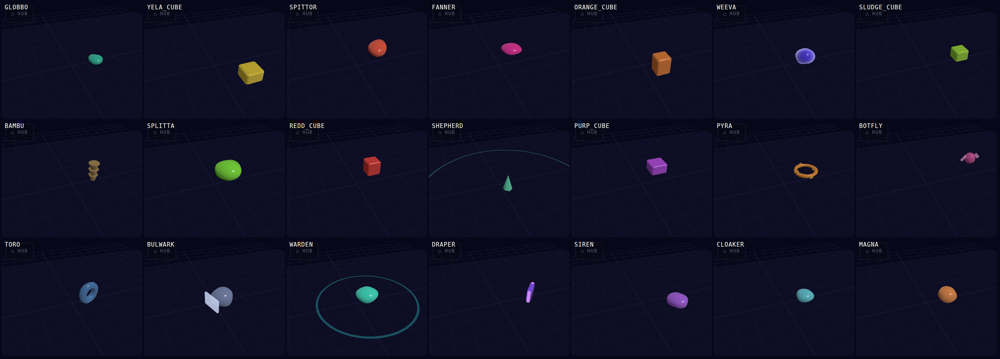

# MODES, WAVES, REVENGE & PROGRESSION — guiding thoughts

*Owner direction, 2026-09-16. Recorded verbatim in §1; everything after it is
grounding and questions, not decisions. Nothing here is shipped or scheduled.
`RUSH_DESIGN.md` (on `main`) is the worked example of one mode; this is the
frame the modes are supposed to sit in.*

---

## 1. The owner's thoughts, as given

1. **Waves.** "Every wave spawns at once, that doesn't seem like the way to go."
2. **Revenge bullets.** "Currently the revenge bullets on enemy death is
   standard, they are quite a lot and cool, but some have different speeds,
   they launch quite randomly, they are hard to read. I must think on if they
   should be there from the start and how we could mix them and shooting
   enemies."
3. **Long term: distinct modes and progression.** "There could be a campaign
   mode, like Geometry Wars 3 and Blade Rush has, and how our Rush mode should
   have."
4. **The main mode** "should have a good base set of enemies and goals.
   Distinct session length and that *one more go* feel. It might use roguelike
   updates like Sektori or maybe that's a separate mode."
5. **Study progression** in Sektori ("hard and confusing with tons of modes")
   and in games where it is clearer.

---

## 2. What the game does today — the parts these thoughts touch

Read this before answering §5; two of the questions dissolve once the code is
in view.

### 2.1 A wave is a 3-second pour into a 20-second round

- A round is **20 s** (`ROUND_DUR`, `main.js:65`). The director builds the
  whole wave as a list and hands it to the pump with per-entry delays.
- The delay between entries is `cadence.normal` **0.18 + rand 0.5 s** and
  `cadence.swarm` **0.08 + rand 0.28 s** (`tuning.js`, `waves.cadence`). The
  arithmetic: wave 1's budget (`5 × 0.85`) buys 2–4 entries, on the field
  inside **~1.5 s**; wave 10's (`5 + 1.8×9 ≈ 21`) buys 8–12, all landed by
  **~4–5 s**. The remaining 15+ seconds of every round are clearing.
- **This is deliberate, and it was solving a different problem.** The
  comment at `main.js:303` says it outright: *"Tight spawn cadence so most of
  the budget is on-field before the player can clear it (prevents instant
  wave-end from trivialising waves)."* A wave ends on `all dead + timer
  elapsed` (GDD §2). So "spawns at once" is not an accident to fix — it is a
  load-bearing choice, and changing the pour means deciding again what a wave
  *is* and what ends it. That is §5 Q3/Q4.
- **The other pacing already exists in the codebase.** SMASH TV re-paces the
  same list as *pulses*: bursts of 3, every 2–3 s, from one door, walking
  around the room, for the whole wave (`main.js:311–330`, `cadence.smashPulse`).
  Whatever the main game's answer is, the pulse machinery is a cabinet-only
  branch today, not new work.

### 2.2 Revenge is not "standard" — it is the *whole* bullet game, in one mode

- **CLOSE COMBAT is the default** (`main.js:2663–2666`, v198: absent key
  means ON). In it, living enemies are **muzzled** (`MUZZLED_BULLETS`,
  `main.js:2668`) — *the only bullets on the field are revenge.*
- **In classic (CLOSE COMBAT off), revenge never fires** — the whole block is
  gated on `meleeRun` (`main.js:3831`).
- So the field is **binary today: revenge-only, or living-fire-only, never
  both.** "Should they be there from the start / how to mix them with
  shooting enemies" is therefore not a tuning question — the game has no
  state in which the two coexist. Mixing them is a new state (§5 Q8).
- **"Some have different speeds" — two speeds, and the fast one is the
  elite's.** Every revenge dialect fires at `revenge.speedMult` **0.6×**
  (`main.js:3845, 3853`) — one speed, on purpose ("the graze game, not a
  wall"). The exception is the **VOLATILE** affix: its 8-bullet corpse ring
  calls `spawnDir` *without* the multiplier (`main.js:3813–3819`) and so
  leaves at **1.0×**. An elite that dies next to you fires a full-speed ring
  while every other corpse fires a slow one. That is the speed inconsistency,
  and it is one line.
- **"They launch quite randomly."** Three dialects (`revenge.byType`): AIMED
  (3-shot burst at your position), FAN (5-shot ~115° arc at your position),
  RING (4 / 7 / 14 bullets, evenly spaced, **random rotation**). The AIMED
  and FAN dialects are *not* random — they point at you. The RING's phase is
  `Math.random()` (`main.js:3849`), so two identical corpses bloom
  differently, and — a finding, not a fix — it is `Math.random()` rather than
  the run's seeded `rng()`, so **daily-seed runs are not deterministic once a
  corpse blooms.** Same at `main.js:3841` for a corpse standing exactly on
  the player.
- **"Hard to read."** A corpse's dialect depends on its species, its colour on
  a hue-shift of the species' bullet colour (`revengeColor()`), its count on
  its radius, and its speed on whether it was a volatile elite. Four
  variables per bloom, decided at the instant of death, by a body the player
  has just stopped looking at. The tell (v145's orange strobe) exists only for
  VOLATILE. Everything else has no telegraph because death *is* the trigger.

### 2.3 There are already thirteen ways to start the game

From the title and OPTIONS: classic arcade, roguelike (GDD §2 says *this* is
the default), CLOSE COMBAT (v198 says *this* is the default — the two stack),
SMASH TV, RUSH, DAILY, LEVELS (three bundled), and six cabinets (on hold,
still shipped). **"Tons of modes" already describes us**; Sektori's eight is
fewer. The difference is Sektori unlocks them behind its first boss, and we
put ours on the title screen.

### 2.4 Rush is already a campaign seed

Timed levels, a per-level PAR, S/A/B/C tiers, two goals per level, a stamp
you keep (`RUSH_DESIGN.md` §2–3). That is Geometry Wars 3's *level* — a
score-tiered, goal-carrying, replayable unit. What it lacks is the *path*:
the thing that makes level 7 come after level 6 and makes stars mean
something.

---

## 3. Reference study

### 3.1 Geometry Wars 3: Dimensions — the clear one

- **Adventure**: 50 levels on a **straight path**, no skipping; you need one
  star on a level to move on. **Three score tiers per level = three stars,
  150 total.** Stars gate the boss levels and buy ship upgrades (drones,
  supers).
- Every level pairs **a mode variant with an arena shape** — Pacifism on a
  sphere, King on a cube, Deadline on a flat plane with a wall through it.
  The classic modes are not menu peers; they are *flavours the campaign
  hands you*, one per level, and the whole legacy set lives in a separate
  CLASSIC drawer for people who already know them.
- **Why it reads clearly:** one path, one currency, one thing to do next.
  The variety is *inside* the path, not beside it.

### 3.2 Sektori — the "one more run" one, and the confusing one

- **Campaign: 5 worlds (6 on the highest difficulty), a boss at the end of
  each, ~30 min per run** on the base difficulty. Bosses are drawn at random
  with Gen 1.0 / Gen 2.0 variants, so runs differ.
- **Deck**: enemy remains buy upgrades (speed, blaster, shield, boost,
  missiles, score); you curate a deck of what can be offered. Three
  difficulties.
- **After the first boss, eight alternate modes unlock at once** — Classic
  with mutators, Surge (swap between under- and over-powered), Crash
  (dash-only kills), Assault (dwindling-clock waves), Gates (rotating laser
  posts), Boss Rush, and more.
- **Why it is confusing:** difficulty × mode × deck is a three-axis grid,
  handed over all at once, with the modes as menu peers. **Why it is praised
  anyway:** every mode is score-based and short, so "jump back in" has no
  friction. The reviews that call it one of the best modern twin-sticks and
  the ones that call it hard and confusing are describing the same design.
- The lesson is not "fewer modes". It is **the doors and the depth are
  separate problems**: Sektori nails depth-per-door and fumbles the number
  of doors.

### 3.3 Blade Rush — could not be fetched from here

The egress proxy blocks both `noba.games` and the Steam store. What the
search surfaced: Noba's Games, a one-stick shooter, **boost + overheat** as
the core, "petri dish" arenas, and "a wide variety of challenges, unlocks
and additional content". `RUSH_DESIGN.md` §1.3 already borrows its roster
roles. **The owner knows this one better than this doc does** — §5 Q11 asks
for the specific thing about its campaign that is worth taking.

### 3.4 The Housemarque shape, for contrast

Super Stardust HD / Resogun: **one arcade path — five planets, a fixed number
of phases each, a boss per planet** — and the rest is leaderboards. Almost no
modes at launch. Sektori's reviews keep invoking this lineage because it is
the *clear* version of the same fantasy: constant pressure, a definite end,
a number to beat. Toko Drop's fixed-screen arena is closer to this than to
Geometry Wars' scrolling grids, which matters for §5 Q3.

---

## 4. A frame to argue with — proposal, not decision

Written down so the questions in §5 have something concrete to push
against. Every line is reversible.

**Three doors, one drawer.**

| door | what it is | session | already have |
|---|---|---|---|
| **ARCADE** | the main mode. One roster, fixed length, a definite end, a score. The "one more go" mode. | ~8–12 min | classic waves, the director, the roster |
| **CAMPAIGN** | authored levels on a path. Stars from score tiers gate the path and the bosses. Each level may carry a mutator (CLOSE COMBAT, SMASH pulses, a Rush level…) the way GW3 carries a mode. | 1–3 min per level | the level editor, `level.js`, Rush's tiers/goals/stamps |
| **ROGUE** | the long form: the deck. Escalating, ends when you die. | 20–30 min | roguelike cards (GDD §7) |
| *CLASSICS* (drawer) | the six cabinets and SMASH TV as tributes, unchanged | — | shipped, on hold |

DAILY becomes a *seed* on ARCADE, not a door. CLOSE COMBAT becomes a level
mutator and a Rush ingredient, not a global toggle that silently decides
whether the bullet game exists.

**Waves become fronts.** Keep the 20 s round; pour it as **2–4 pulses across
the round** (the SMASH machinery, retargeted), with the last pulse landing at
~14 s so the round's end is always earned by the clock, not by an empty
floor. "Wave clear" stays as a non-interrupting beat (GDD §2's fixed rule).

**Revenge becomes a species trait, not a mode.** Some species shoot alive.
Some bite back dead. A few do both, and *those* are the elite tells. It
enters the roster like everything else — a `minWave` — so wave 1 has no
corpse fire and the first species that has it uses the most readable dialect
(RING), at one speed, seeded. CLOSE COMBAT then stops being "the mode where
revenge exists" and becomes "the mutator where the guns are taken away".

---

## 5. The questions

Grouped. Each says what it decides and, where there is one, a lean. **The
lean is a prompt, not a vote.**

### A. The session

1. **How long is one ARCADE run meant to be, in minutes?** This decides
   almost everything below — wave count, roster unlock pacing, whether a
   boss fits. GW3 levels run 1–3 min; Sektori runs 30. *Lean: 8–12, because
   "one more go" needs the run to end while you still want more.*
2. **Does ARCADE end?** A win state (a boss at wave 10 or 12, then a
   score), or endless escalation (today)? *Lean: it ends. Endless is what
   ROGUE is for.*

### B. Waves

3. **Pulses inside a round, or no rounds at all?** Fronts (§4) keep the
   20 s beat and the "WAVE N" banner. The Housemarque alternative is a
   continuous pressure curve with no wave concept — spawns as a function of
   time and live bodies. *Lean: pulses first; it is the smaller change and
   reuses shipped code. Revisit if the banner starts to feel like a lie.*
4. **What ends a round — the clock, an empty floor, or both?** Today both.
   If bodies arrive across the whole round, "all dead before the clock"
   becomes rare, and the wave-clear moment mostly disappears. *Is that
   moment wanted?* If yes, the last pulse must land early enough to clear.

### C. Revenge

5. **Who bites back — every corpse (today, in CLOSE COMBAT) or named
   species?** *Lean: species. It makes the tell learnable ("the purple ones
   bloom") instead of universal.*
6. **Is there corpse fire in wave 1?** *Lean: no. It arrives at wave 3–4 as
   a roster unlock, RING first, and the game teaches it the way it teaches
   BULWARK's plate.*
7. **One speed?** Today 0.6× for everything and 1.0× for VOLATILE elites'
   rings — the fast one is the one that also has the most bullets. *Lean:
   one speed; VOLATILE's payoff becomes count, not velocity. Also: seed it.*
8. **Mixed field.** Living fire *and* revenge on the same floor — is that a
   state we want, and at what ratio? Or is CLOSE COMBAT's purity ("the
   only bullets are the ones you made") the identity worth protecting, so
   living fire is *another* level's mutator, never mixed? *No lean; this is
   the real design question in the owner's second thought, and playtesting
   the mixed state for an afternoon would answer it faster than arguing.*

### D. Modes and progression

9. **How many doors on the title?** Thirteen today (§2.3). *Lean: three plus
   a drawer (§4).* If fewer than three, which one goes?
10. **Is Roguelike the main mode's default, or its own door?** GDD §2 says
    default; v198 made CLOSE COMBAT default too, so today a new player gets
    both at once. *Lean: own door. ARCADE is the one with no choices in it.*
11. **What is the one thing Blade Rush's campaign does that we should take?**
    This doc could not read it (§3.3). Is it the level shape, the medal
    structure, the unlock pacing, the boss cadence?
12. **Is Rush the campaign, or one ingredient in it?** GW3 pairs a mode with
    each level; on that model a Rush level and a CLOSE COMBAT level and a
    plain level sit on the same path. Or Rush stays its own ladder, as
    `RUSH_DESIGN.md` assumes. *Lean: ingredient. The stamp/tier/goal system
    is already mode-agnostic in shape.*
13. **What do stars buy?** GW3: bosses and ship upgrades. Sektori: nothing —
    the deck is bought with remains instead. Us: the roadmap's Phase 4
    "unlock track" (cosmetics / starting loadouts) is the placeholder. *Lean:
    stars gate the path and bosses only; keep power out of it, so ARCADE
    scores stay comparable.*
14. **Difficulty tiers?** Sektori's three vs none. *Lean: none in ARCADE —
    the star tiers are the difficulty in CAMPAIGN, and ROGUE escalates.*

### E. How we'd know

15. **What gets measured?** "One more go" is a number: **restart rate within
    10 s of the death screen**, and the session-length distribution. The
    death-screen feedback pipeline already posts a run summary; adding
    `restartedWithin` and `runLength` to it costs one field each. *Lean: add
    them before changing anything, so the wave/revenge changes have a
    before.*

---

## 6. Findings recorded while writing this (not fixed — owner did not ask)

- VOLATILE's corpse ring fires at 1.0× while every other revenge bullet is
  0.6× (`main.js:3813–3819` vs `3845/3853`). One `R.speedMult` argument.
- Revenge RING phase and the on-top-of-player fallback use `Math.random()`
  (`main.js:3841, 3849`); the run's `rng()` is what the daily seed
  reproduces. Dailies diverge at the first bloom.
- GDD §2 and `main.js:2663` name two different defaults (Roguelike;
  CLOSE COMBAT). Both are true; the GDD does not say so.
- `TOKO_DROP_ROADMAP.md` had forked between `gh-pages` (v237 note) and
  `main` (v228/v229/v231 ticks, the Godot-sibling note). Reconciled in the
  commit that adds this file — both halves kept.

---

## 7. Answers so far — the Q&A (2026-09-16)

**How this runs (owner rule):** two questions at a time, **numbered, answered
in the owner's own words**. Multiple choice only for quick, easy picks;
otherwise offer a / b / c as text and let the answer be a sentence.

Answers are recorded as given. Where an answer was an option number, the
option is spelled out and the reading is flagged so it can be corrected.

| # | question (§5) | answer | status |
|---|---|---|---|
| 1 | Run length / does ARCADE end? | **Endless, escalating — as today.** | decided |
| 2 | Wave shape | **Pulses across the 20 s round** (the SMASH machinery, retargeted). | decided |
| 3 | Who bites back, from which wave? | *"Hard to say, maybe 1"* — leaning **named species, entering at wave 3–4**, RING first, one speed, seeded. | open, lean |
| 4 | Mixed field (living fire + revenge)? | **Playtest the mixed state first.** Flip the flag for an afternoon; decide from a screenshot and a run count. | decided (test) |
| 9 | Doors on the title | *"For now 1, but at launch maybe 3.."* — read as: **three doors + a CLASSICS drawer now; Sektori-style unlocks (one door, the rest earned) maybe at launch.** | decided-for-now; reading flagged |
| 10 | Where do the upgrade cards live? | *"For now 1"* — **own ROGUE door**; *"up in the air depending on where these modes develop to."* | decided-for-now |
| — | What ends a round, once pulses spread across it? | *"3 likely but I would like to test 1"* — **empty-floor-only is the likely rule; test clock-only first.** Both need the last pulse early enough to clear. | test, then decide |
| 12 | Rush: the campaign, or an ingredient? | First pass: *"2 sounds right but I don't understand 1 and 3"*; after rewording: **"Likely Rush IS the campaign — but that may not have exactly the current Rush rules, as those are copied from Blade Rush and are tested as optional mechanics that may be used somewhere."** | lean; see note |
| 11 | What to take from Blade Rush's campaign? | **"Like Geometry Wars 3, which we can use as reference. It has different rooms with timed goals and S, A, B, C, F tiers. Along with added mechanics, level shapes, etc."** — so the campaign unit is a *room* with a *timed goal*, graded **S/A/B/C/F** (an F tier we do not have), and the path adds **mechanics and level shapes** as it goes. GW3 is the reference to read. | decided (reference) |
| 16 | What are the families built on? | **"Domes are one family, same with cubes, others are other family, and more may arise."** — family = **shape class**. Dome, cube, and each one-off silhouette is its own family; new shapes are new families. | decided |
| 17 | Within one family, how are species told apart? | **"Domes are different hues and different sizes. Big are likely slower, may move differently. Some divide etc. Colour is main difference."** — colour = species identity within the family; size correlates with speed/behaviour. | decided |
| 18 | How does a dome show it shoots, before it does? | **a) They don't — the first shot teaches it**, like every other trait. No stance, core or spout. | decided |
| 19 | The fish / SCHOOL — behaviour, shape family, or the campaign's roster? | **b), loosely: "We can have a family for those, but let's play with shapes more. The fish can be bugs as well or just squiggly lines."** — the arc-movers get their own shape family; what that shape IS stays open and wants exploration, not a decision. | decided (family yes, shape open) |
| — | Colour for shooting vs non-shooting? | Not that axis — **families**. Owner's direction verbatim in §8. | direction; questions in §8.3 |

**The Rush note matters.** The campaign door being "Rush" does not commit it
to boost-heat-chain as shipped in v224–v227. Those rules are *a tested
ingredient*, portable to wherever they fit. So `RUSH_DESIGN.md` describes a
mechanic set, not the campaign's identity. What the campaign's own rule set
is, is still open — which is why Q11 (what to take from Blade Rush) is next.

**Still to ask:** what campaign progress buys (Q13); difficulty tiers (Q14);
what we measure (Q15); and §8.3 — starting with Q16, re-asked after §8.4.
**Format update (owner):** one question at a time when they are long.

---

## 8. Enemy families — the colour question is a family question

### 8.1 The owner's direction, as given

> "Think of these more like **shape and movement families**. Original enemies
> vary on movement and shooting type, thus having different colors.
> Non-shooting types can still move differently and also shoot revenge
> bullets in different patterns. **All base-mode enemy silhouettes
> communicate movement, speed and durability.** Sometimes even aiming to do
> special damage — like green enemies leave toxic puddles. Rush mode had
> Blade Rush enemies that look like **fish that move in arcs**, thus varied
> movement, and the hitbox is shown in style. These are all relevant."

The question that prompted it — *"can we colour-differentiate shooting and
non-shooting enemies? Currently colour differences for non-shooting don't
make sense"* — resolves into: **colour should follow a family, and today the
non-shooters' colours follow nothing.**

### 8.2 What the roster's colours map to today

Every species already has a movement role (`tuning.js` `movement.byType`,
v210). The table pairs it with the values the silhouette is supposed to
communicate and the body hue it actually wears.

| species | shape | movement role | spd | hp | size | gun | body hue |
|---|---|---|---|---|---|---|---|
| GLOBBO | blob | DRIFTER | 2.8 | 1 | 0.55 | – | teal 169° |
| YELA_CUBE | cube | DRIFTER | 2.2 | 2 | 0.70 | – | yellow 52° |
| ORANGE_CUBE | cube | DRIFTER | 1.4 | 4 | 0.75 | aimed | orange 32° |
| REDD_CUBE | cube | DRIFTER | 1.9 | 3 | 0.75 | – (splits) | red 4° |
| PURP_CUBE | cube | DRIFTER | 1.6 | 3 | 0.75 | fan (splits) | violet 283° |
| SPITTOR | blob | HOLDER | 1.6 | 3 | 0.90 | aimed | red 9° |
| FANNER | blob | HOLDER | 1.4 | 3 | 0.75 | fan | magenta 320° |
| WEEVA | blob | HOLDER | 0.6 | 3 | 0.80 | fan | blue 250° |
| BAMBU | – | HOLDER | 0 | 1 | 0.70 | fan | tan 40° |
| BOTFLY | flyer | HOLDER | 2.0 | 2 | 0.50 | homing | pink 324° |
| DRAPER | – | HOLDER | – | – | – | curtain | violet 264° |
| SLUDGE_CUBE | cube | MASS | 0.75 | 2 | 0.65 | – (trail) | lime 77° |
| BULWARK | plate | MASS | 1.5 | 4 | 0.90 | – | steel 222° |
| TORO | – | COMMIT | 5.0 | 6 | 1.00 | – | blue 210° |
| SPLITTA | blob | SCHOOL | 1.0 | 5 | 1.10 | – (splits) | green 92° |
| PYRA | – | HUNTER | 0 | 4 | 1.00 | fan | orange 36° |
| CLOAKER | – | HUNTER | 2.4 | 3 | 0.70 | aimed burst | ice 187° |
| WARDEN | – | SUPPORT | 1.1 | 5 | 0.85 | – (shield) | mint 170° |
| SIREN | – | SUPPORT | 1.2 | 3 | 0.75 | – (surge) | lilac 273° |
| MAGNA | – | SUPPORT | 0.9 | 4 | 0.80 | – (pull) | amber 27° |
| SHEPHERD | – | HERDER | – | – | – | – (herds) | mint 160° |

What the table says:

- **The five DRIFTERs wear five hues** (teal, yellow, orange, red, violet).
  They are the "ordinary bodies" — the family that should read as one — and
  they are the least uniform group on the field. This is the owner's
  complaint, located.
- **The three HOLDER blobs** (SPITTOR / FANNER / WEEVA) wear red, magenta
  and blue. Same shape, same role, same job; three unrelated colours. The
  gun *dialect* differs (aimed / fan / fan) — but colour is not carrying that
  either, because ORANGE_CUBE (aimed) is orange and PYRA (fan) is also
  orange.
- **The one thing that works is shape**: blob vs cube is legible, and the
  sub-roster stays consistent with it (cubes are DRIFTER/MASS, blobs are
  DRIFTER/HOLDER/SCHOOL). Shape is already a family axis; colour is not.
- **Green already means "leaves something on the floor"**: SLUDGE_CUBE's
  trail (lime), SPLITTA's spawn (green), and loadout's toxic-green GRUNT.
  That is the one colour rule the roster has by accident, and it is the one
  the owner named. Worth making deliberate.
- **Two colours are near-collisions across families**: WARDEN mint 170° vs
  GLOBBO teal 169° (a shield-bearer and the most common fodder, 1° apart);
  SHEPHERD mint 160° sits between them. MAGNA amber 27° vs ORANGE_CUBE 32°
  vs PYRA 36° — a puller, a drifter and a stationary gun within 9°.
- **Movement, speed and durability are already in the numbers** but the
  silhouette does not carry them consistently: TORO (spd 5, hp 6) and WEEVA
  (spd 0.6, hp 3) are both ~0.8–1.0 radius. The owner's rule — *silhouette
  communicates movement, speed, durability* — would make size/shape encode
  hp and speed, and leave colour free for family.
- Finding: **PYRA is `HUNTER` with speed 0.** Either the role is dead on it
  or the speed is; the v210 audit did not catch it.

### 8.3 Questions on families — next in the queue

16. **What are the base-mode families?** The movement roles give eight
    candidates (DRIFTER, HOLDER, MASS, COMMIT, SCHOOL, HUNTER, SUPPORT,
    HERDER). Eight hues is too many to learn; four or five is not. Which
    roles merge into one family for the player's eye (e.g. HUNTER + COMMIT
    = "comes at you"; SUPPORT + HERDER = "has a job, kill it first")?
17. **Does colour = family, or does colour = family *and* something else?**
    a) hue = family only; speed/durability are silhouette (size, shape).
    b) hue = family, value/saturation = tier within it (a brighter DRIFTER is
    a faster one). c) hue = family, with one reserved hue for "special
    damage" (green = puddle/trail) that overrides the family.
18. **Does the gun show, and how?** If colour is family, the shooter/chaser
    distinction needs another channel: an emissive core that lights when
    armed and goes dark when muzzled (CLOSE COMBAT), a barrel/aperture in
    the silhouette, a HOLDER stance (it stops). Or is "HOLDERs shoot" a
    family fact the player just learns?
19. **The fish.** The Rush roster's arc-movers (SCHOOL role: SPLITTA,
    GRUNT, FLIT, GHOST, the MINIs) are the Blade Rush lineage — varied
    movement, hitbox shown in the style. Is SCHOOL a base-mode family, or is
    it the campaign door's own roster the way the cabinets have theirs?
20. **Revenge dialect per family?** The owner: *non-shooting types can still
    shoot revenge bullets in different patterns.* Today the dialect is per
    species (`revenge.byType`). If it became per family, the bloom would be
    predictable from the colour — the readability fix without a telegraph.

### 8.4 Looking at the shapes — Q16 was asked from the wrong table

The owner: *"Please look at the shapes and rethink this question."* §8.2 was
built from movement roles and numbers. This is what the roster actually
looks like — every base species from `enemy-lab.html`, one frame each:

*`toko-drop/design/roster-sheet-2026-09-16.png` — WebGL build, lab default
camera, captured by driving `window._lab.select()` per species.*

What the picture says, with the geometry to back it (`enemy.js:672–727`):

- **Ten of the twenty-one are the same gel dome** (`BLOB_TYPES`,
  `enemy.js:586`): GLOBBO, SPITTOR, FANNER, WEEVA, SPLITTA, WARDEN,
  BULWARK, SIREN, CLOAKER, MAGNA. One geometry (`BLOB_GEO`), varied only by
  `mesh.scale` and colour. Between them they cover **six of the eight
  movement roles** — DRIFTER, HOLDER, SCHOOL, SUPPORT, MASS, HUNTER — so
  the dome silhouette carries **no** family information: whatever role you
  name, there is a dome that has it.
- **Five are the same rounded cube** (`CUBE_TYPES`): YELA, ORANGE, SLUDGE,
  REDD, PURP. Roles DRIFTER and MASS; two of them shoot, three do not; two
  split. Again the shape says "cube", not what it does.
- **Six have a silhouette of their own**, and every one of those reads:
  TORO's torus (charger), BAMBU's stacked cylinders (grows, stationary),
  PYRA's spinning ring (stationary gun), BOTFLY's winged sphere (flyer),
  SHEPHERD's spire (conductor — the code comment says exactly this: *"nothing
  else in the roster is tall-and-thin"*), DRAPER's slab (the loom). The two
  shape *attachments* read too: BULWARK's plate and WARDEN's aura ring.
- So the roster already contains its own answer. **Where a species has a
  unique silhouette, colour is free to be anything and nobody is confused.
  Where ten species share one dome, colour is being asked to do shape's
  job — one hue per species — and that is precisely the "colour differences
  that don't make sense".** The complaint is not about the colours. It is
  about ten domes.
- Durability and speed are invisible: SPLITTA (hp 5) and GLOBBO (hp 1) are
  the same dome at two scales; TORO (spd 5) and WEEVA (spd 0.6) are similar
  in mass on screen. The owner's rule — *silhouette communicates movement,
  speed, durability* — has nowhere to live on a dome.
- The dome is not an accident to remove: it is **the goo showpiece**, art
  pass priority 1, the reason the WebGPU/TSL build exists. So the question
  is not "dome or not" — it is what a *family* adds to the dome.

**Q16, re-asked** (one question, in the owner's words please):

> The base roster has three shape classes: the gel dome (10), the cube (5),
> and six one-offs that already read. Which of these should the families be
> built on?
>
> a) **Dome + family silhouette.** Every family keeps the gel material and
>    gets one *silhouette modifier* that says its role — a spout or
>    aperture for HOLDERs (it has a gun), a low wide squash for MASS, a
>    tapered teardrop for HUNTER/SCHOOL (it moves in arcs), a crown or ring
>    for SUPPORT (WARDEN's aura is already this). Colour = family,
>    reinforcing the silhouette; size = durability.
> b) **One primitive per family.** Dome = fodder/drift only. Cube = MASS.
>    Torus = charger. Spire = conductor. Ring = stationary gun. Each family
>    owns a primitive the way the six one-offs already do; the ten domes get
>    re-shaped or merged down. Colour becomes free again.
> c) **Fewer species.** The ten domes collapse to three or four with clear
>    roles; the cubes to two. The roster gets smaller and every survivor gets
>    its own silhouette. Colour = family.
> d) Something else — what would you draw?

### 8.5 Q16 answered — family = shape

> "Domes are one family, same with cubes, others are other family, and more
> may arise."

So the family is the **shape class**, full stop: the gel dome is one family
(ten species today), the cube is one (five), and each distinct silhouette —
torus, stack, ring, wings, spire, slab — is its own; new shapes are new
families. Not a movement role, not a gun. This makes the roster's existing
shape split the law rather than an accident, and it means the ten domes are
*meant* to be one thing to the eye.

What follows, and is now the next question: inside a family of ten, what
tells one dome from another — and is colour still the answer there.

**Q17, next:** within one family (the ten domes), how are species told apart?
a) **One family hue; species differ by size and behaviour only** — a dome is
   a dome, you learn what it does by what it does.
b) **Family hue with a per-species tint** — all domes in one hue range
   (say, cool), each species a step within it.
c) **Colour stays per species** (as now) and the family is carried by shape
   alone — colour is identity, not family.
d) **Colour = what it does to you**: one reserved hue per *effect* (green =
   leaves something, red = shoots, etc.) that crosses families.

### 8.6 Q17 answered — within a family, colour is the species

> "Domes are different hues and different sizes. Big are likely slower, may
> move differently. Some divide etc. Colour is main difference."

So: **shape = family, colour = species, size ≈ speed and behaviour class.**
Colour is not asked to carry the gun or the role; you learn what a hue does
by what it does. The original complaint ("colour differences for non-shooting
don't make sense") resolves to a *consistency* rule rather than a
re-colouring: within a family, no two species may share a hue, and size must
track speed (big = slower). Today that second rule is broken in places —
WEEVA (r 0.8, spd 0.6) and SPITTOR (r 0.9, spd 1.6) are near-equal domes at
very different speeds; SPLITTA (r 1.1, spd 1.0) is the biggest dome and
mid-speed. Worth a pass, not a redesign.

**Q18, next:** if colour is species and shape is family, how does a player
know a dome *shoots* before it does?
a) They don't — the first shot teaches it, like every other trait.
b) A **stance**: shooters stop to fire (HOLDER already holds its ground); the
   stop is the tell.
c) A **lit core** while armed, dark when muzzled (CLOSE COMBAT).
d) A silhouette detail on the gel (spout / aperture) — a within-family
   modifier, not a new family.

### 8.7 Q18 answered — the gun is learned, not shown

**a)** No pre-fire tell on the body. A species' gun is one more thing its
colour means, learned by being shot at once. This closes the shooter/non-
shooter thread where it began: colour = species, and species = everything it
does, gun included. (BOTFLY's charge flicker and VOLATILE's strobe stay —
those telegraph a *shot*, not a *shooter*.)

**Q19, next:** the fish. The arc-movers (`SCHOOL` role: SPLITTA, the MINIs,
GRUNT, FLIT, GHOST) are the Blade Rush lineage — a movement pattern, not a
shape. Under "family = shape", SPLITTA is a dome. Is SCHOOL:
a) just a behaviour some domes have (as now),
b) its own shape family (a fish silhouette, "hitbox shown in style"),
c) the campaign door's own roster, separate from ARCADE's?

### 8.8 Q19 answered — the arc-movers get a family; the shape is open

> "We can have a family for those, but let's play with shapes more. The fish
> can be bugs as well or just squiggly lines."

So SCHOOL becomes a **shape family** — not a behaviour some domes have. But
the silhouette is not chosen: *fish*, *bugs* and *squiggly lines* are three
different readings of the same movement, and the instruction is to play with
them rather than pick one from a doc.

**This is the first family whose shape has to be designed rather than
observed**, and it is the natural end of the Q&A: the remaining work is
drawing, not answering. Three notes for whoever picks it up:

- **The method is `ART_PIPELINE.md`'s — every stage ends in a picture.**
  `scripts/enemy-loop.mjs` records a looping GIF of an enemy *behaving*,
  driven by the real game code. An arc-mover is a movement first, so a still
  silhouette cannot settle it; the loop can. Add a SCENARIO rather than
  hand-rolling a capture.
- **The lab is the place, not the game.** `enemy-lab.html` is the visual
  source of truth and is rebuilt on `js/specimen.js`, so a candidate shape
  can be looked at without touching the shipped roster.
- **"Squiggly lines" is a real third option, not a joke about the other
  two.** A tube/ribbon along the movement path is a different rendering
  problem from a rigid body — closer to `DRAPER`'s loom or a trail than to
  a mesh — and would be the roster's first non-solid silhouette. If that is
  the direction, it belongs in the TSL pass, not a `BoxGeometry`.

**Q&A status: the family rules are settled.** shape = family · colour =
species · size ≈ speed · the gun is learned, not shown · domes, cubes, the
one-offs and now the arc-movers are families, and more may arise. What is
left is §5's remaining questions (what campaign progress buys, difficulty
tiers, what we measure) and the drawing above.
